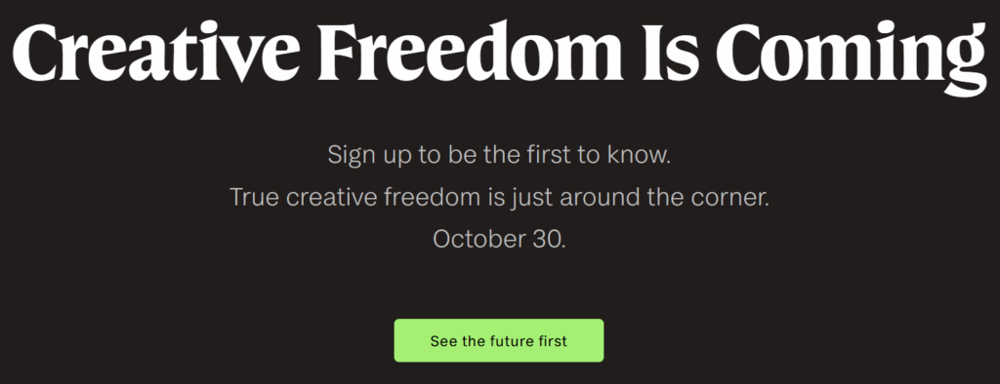
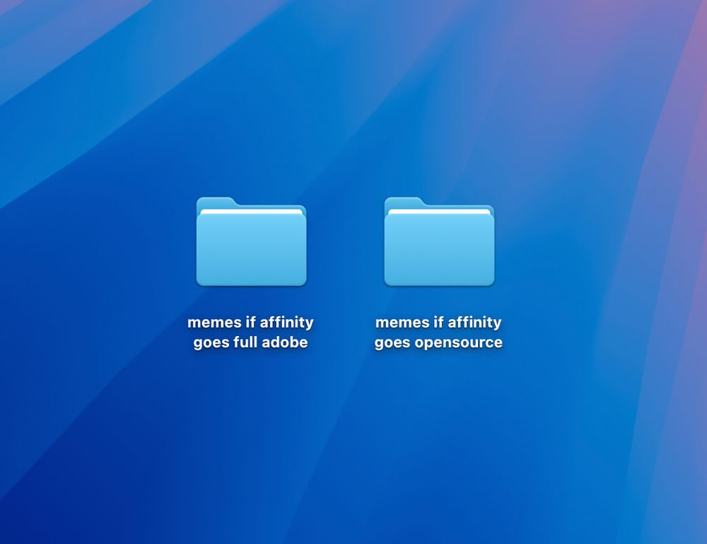

+++
title = "Thoughts on Affinity Studio, and Creative Freedom™️"
date = "2025-11-03"
+++
Affinity Studio is objectively the best 2D graphics tool I've used, but there are some concerns.<!--more-->
***
In early October, Affinity made a bombshell announcement. They took down their main page and replaced it with this visual:

What?   
What does any of this mean? This isn't even an announcement! It's an announcement of an announcement!

There wasn't much else to glean from this, but they did make their apps free on the Apple store for portable devices. Huh. Well, no use speculating, it would
really just mean one of two things, now, wouldn't it?

October 30th rolls around and the announcement is something I never expected. Affinity Studio, one application, free forever. Oh, look, it requires a Canva account. I guess the catch is they'll change the business model later? Locking access to a supposedly free offline tool behind an online account seems ripe with the potential for a rugpull down the
line. More optimistically, maybe the goal here was to bring more users to Canva. Well, turns out that they actually addressed this: [ Why we made Affinity free, and how we’ll keep it that way](https://www.canva.com/newsroom/news/affinity-free/)

This isn't even something tucked away! It's pretty front and centre, visible as a banner on the Affinity download page itself. 

I find it interesting how the business model i thought there was is in fact the business model for Affinity. Ideally it would be open source, but it really is just as simple as "it brings more users to Canva". What they claim their business model is that designers would use Affinity, and then because of the interoperability between the Affinity file format and the internal file format used by Canva, the folks without the design chops to use a full blown tool can collaborate using Canva. It's about bringing as many folks as they can into the Canva ecosystem.

Like many users have pointed out, open sourcing the thing or even a previous edition of it would go a long way in building trust, but this is a decent enough alternative in the meantime. Seems like Canva is also going to go public soon, but that would help us assess their priorities better through their investor calls, I suppose.