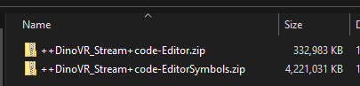
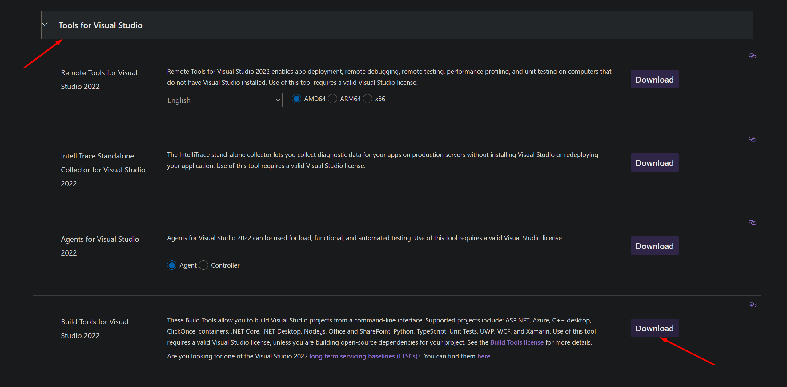

+++
title = "Avoiding the scary project recompile pop-up"
date = "2024-03-28"
+++
Do you want to share C++ projects with teammates without having them go through the painful process of setting up Visual Studio and more? Fear not!<!--more-->
***
You can submit the project DLLs (everything in your project Binaries folder) to your VCS. If you’re using perforce, you can set revision limiting to delete older versions of the binaries (I.e only have the latest X number of binaries in storage)
This way, someone else can use the pulled-down-from-Launcher Unreal version, never having even breathed the word "visual studio community edition", and start it up, and be using your custom C++ stuff like a good Blueprint-only designer.  
  
**Alex Stevens from the Impromptu Games Discord, added:**  
You can still do this even with a source build of the engine... for example, I use the same BuildGraph script that Epic uses for Unreal Game Sync (which zips up all of the necessary binaries), but have made a batch file that downloads the binaries zip on the artists machine. Extracting the engine binaries over their local copy of the source.
When I build these prebuilt binaries, I'm building it for the project, and as such, the engine binaries only include the bare minimum (it doesn't compile and zip every single module). I also separate debug symbols, so now my engine binaries are only 333MB to download for artists.
I also then prebuild the project binaries on my end and then submit them to VCS. Just have to watch out if I make any engine changes, as the modified engine binaries will be different to the distributed ones.

And when it comes to debugging on the artists end, I can run SetupBinaries.bat --symbols to download and install the symbols instead. Basically my own little hacky batch file version of UGS... it's still written for Perforce, but there's no reason why it can't be appropriated for git/svn/etc.  
  

**volodXYZ, a technical artist from Amber Studio, added:**  
What I usually do on small teams (though it feels a bit dirty) is to get everyone to install Visual Studio Build Tools, as they are sufficient for compiling projects in the background and do not require the intimidating Visual Studio editor, which can spook artists like horses.

I add a little 'CleanCompileProject.bat' that deletes 'Binaries/Intermediate' folders, generates project files, compiles, and launches the editor (adding a nice icon to this .bat might also be a good idea, as horses are skittish).Whenever artists pull the latest from the repo, I have them open the editor once using the .bat and make it clear that if at any point they get compile warnings in-editor, they should just close it, double-click the .bat, and life is good again.

Done.
I usually have it delete the intermediate folder of all of my code plugins as well, to catch any changes but that is optional. Here's the basic .bat script:
```bat
    del YOURPROJECTNAME.sln
    RMDIR ".vs" /S /Q
    RMDIR ".idea" /S /Q
    RMDIR "Binaries" /S /Q
    RMDIR "Build" /S /Q
    RMDIR "Intermediate" /S /Q
    RMDIR "DerivedDataCache" /S /Q

    RMDIR "Plugins/YOURPLUGIN/Intermediate" /S /Q
    RMDIR "Plugins/YOURPLUGIN/Intermediate" /S /Q

    set MyUVS="C:\Program Files (x86)\Epic Games\Launcher\Engine\Binaries\Win64\UnrealVersionSelector.exe"
    set MyUBT="C:\Program Files\Epic Games\UE_5.3\Engine\Binaries\DotNET\UnrealBuildTool\UnrealBuildTool.exe"
    set MyFullPath="%cd%\YOURUPROJECTNAME"

    %MyUVS% /projectfiles %MyFullPath%.uproject

    %MyUBT% Development Win64 -Project=%MyFullPath%.uproject -TargetType=Editor -Progress -NoEngineChanges -NoHotReloadFromIDE

    %MyFullPath%.uproject

```