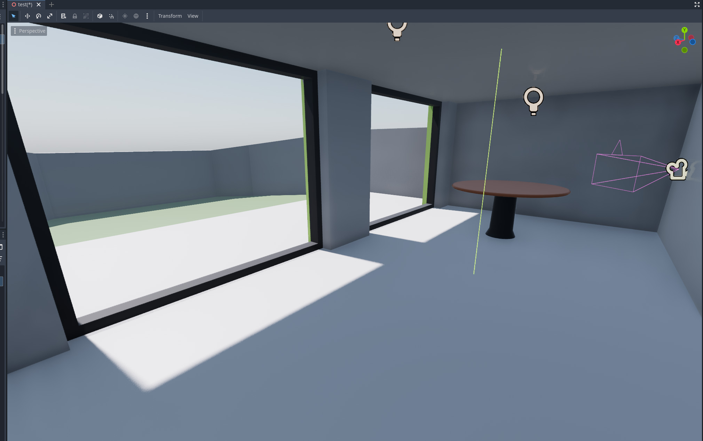
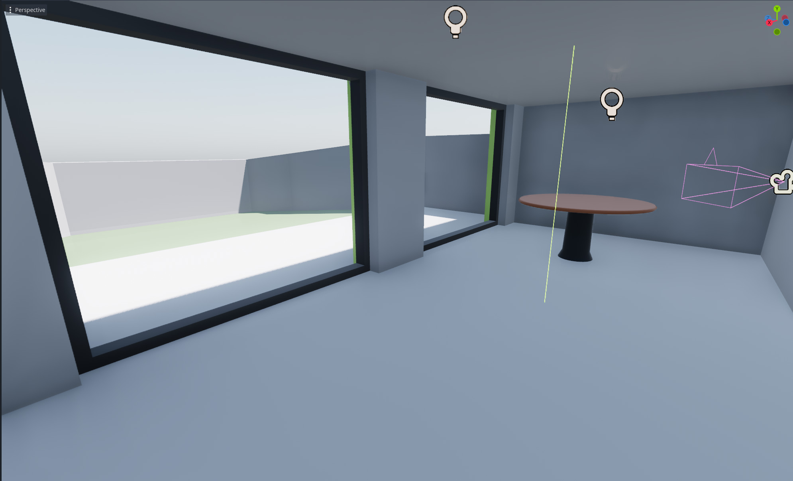
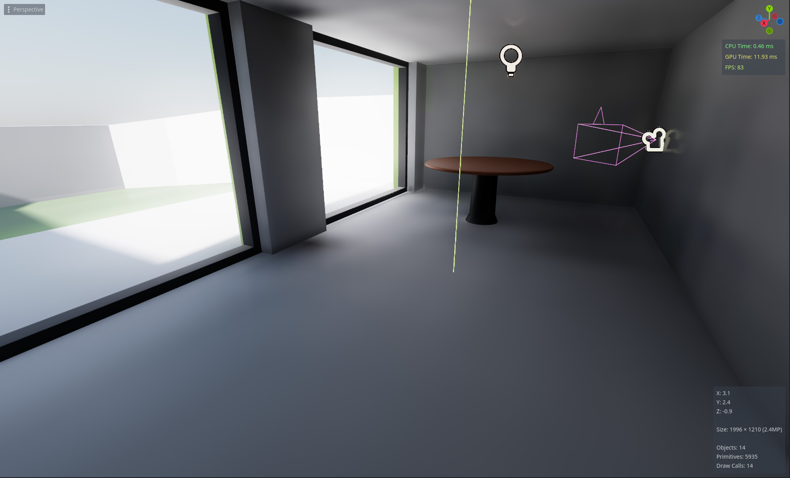
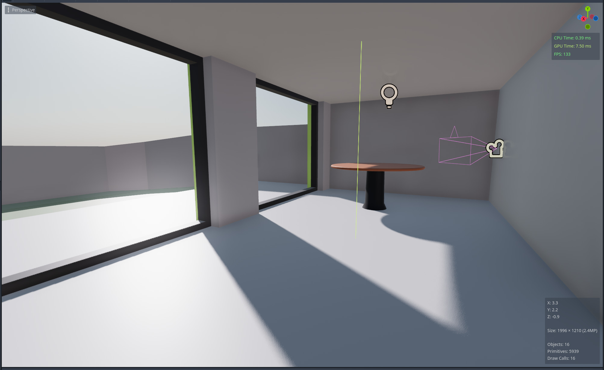
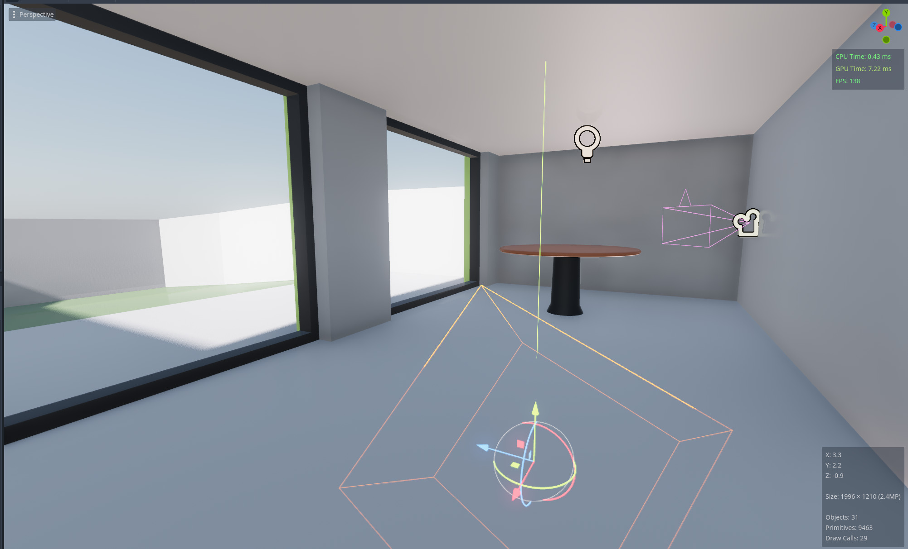
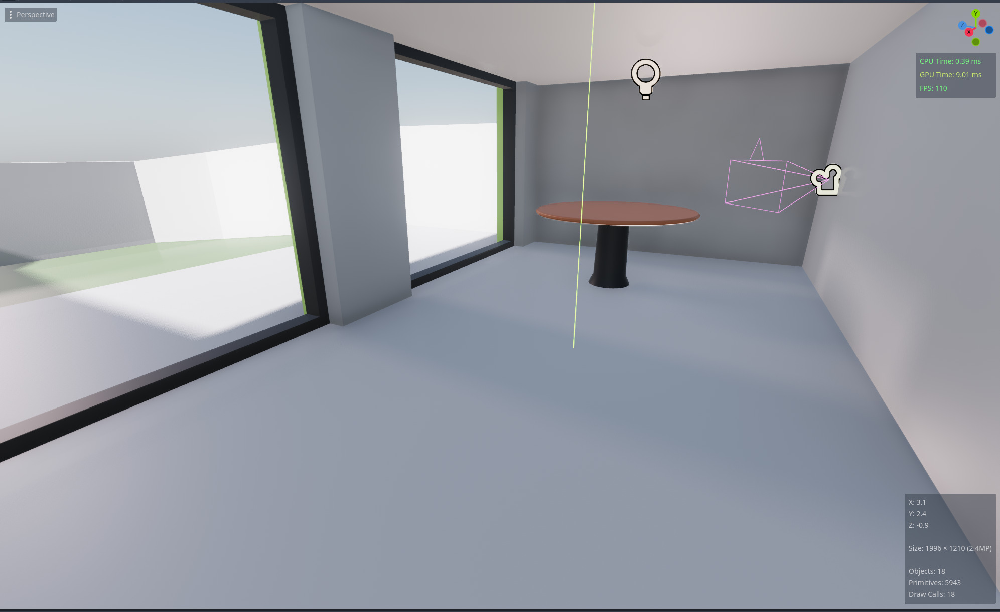
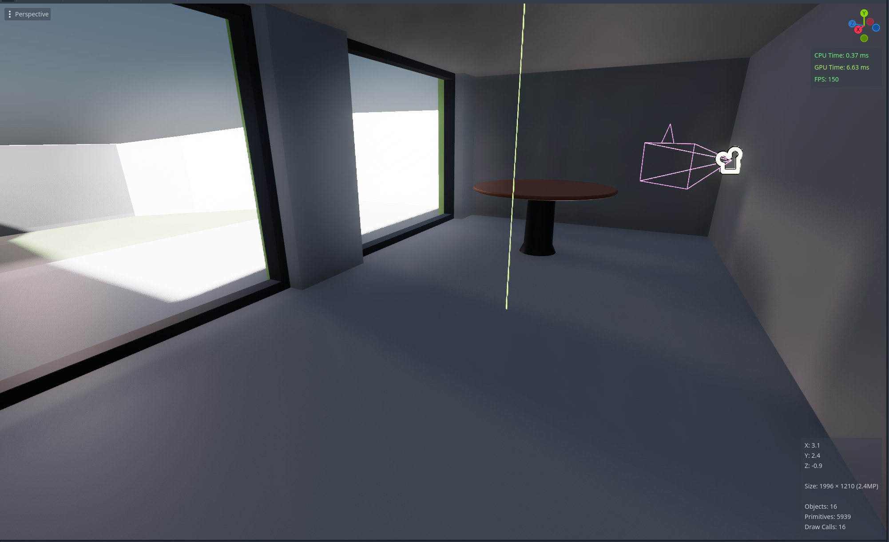

+++
title = "Lighting things up without fancy tech"
date = "2025-01-12"
+++
Giving indirect lighting depth without baking lighting.
<!--more-->
***
*This article was originally posted to Tumblr.*  

Yes, yes, we're in an era of raytracing and whatnot but the Switch still exists and often the folks who most need a game don't have the shiniest new tech to run it on. So I was thinking about stuff related to lighting techniques since IMO that makes up about 60% of the impact of any given game environment.

Generally, you'd have what's called a directional light in your scene. This directional light is usually a stand-in for your sun. If you look at a room in broad daylight, it's not just the sun that's your light source. But directional lights mean you miss out on that contrast if your window is not a sun-facing window, which can make your lighting look kinda flat.

So this is just fine:

But the moment it's made parallel instead of perpendicular....

The lighting starts looking a little samey.

IRL's, every single window and door you have is technically a light source! Additionally, I've observed that each room's parallel light mostly stays the same, varying intensity. (source: my room has a north facing window, so it's almost entirely lit by indirect lighting)

This makes sense. Compare that to a scene with some kind of actual bounced indirect lighting using some kind of Global Illumination, and you get something like this: 

Hm. That's a massive performance hit. 
Could there be some way to do it cheaper?

Add a second sun directional light for bounced indirect lighting. This is a copy of the sun, at roughly 10% of the sun's intensity, lighting in the exact opposite direction to the sun with no shadows.

So now when we go parallel, there's still something going on that gives contrast. Most importantly, trust the process:

Now you can add a shadow casting parallel light to your sun with the same settings as your bounced indirect: 

I think we're starting to see some resemblance!
At its core, we've reached the point where there's something technically novel going on. We can then expand from here!
For example, I can now make my light source interpolate between a set angle for each room when building its mood lighting. 

In my heart of hearts, I believe the most powerful thing, the secret sauce for something that looks, and most importantly, feels awesome is intentionality. We're not aiming to simulate reality anyways, we're aiming to provide a certain experience to our players. That said, I do feel the hate is misdirected. The reason why this is ubiquitous today is not because of laziness, but rather, executive pressure means devs don't get the time/space to be intentional. Also, yes, you can be very intentional with more expensive GI, raytracing and all the fancy schmancy new tech. That's what differentiates really good implementations with the eh ones. This isn't a dig at raytracing. Like anything else, it's a tool to be used. 

Now, having art directed and turned a few dials to make it look good while I was talking about this, here's the final result!
