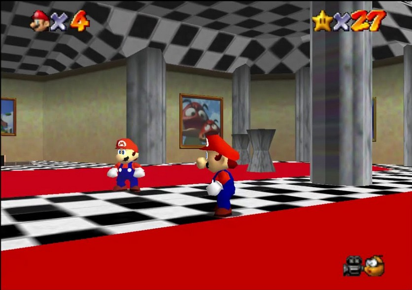
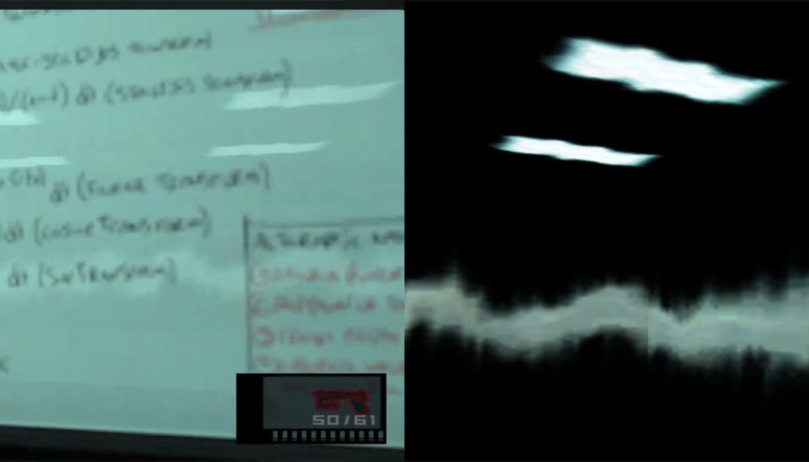

+++
title = "The potential of the duplicate room trick"
date = "2022-10-28"
+++

Let's talk about mirrors and reflections.<!--more-->
***
*This article was ported from a previous iteration of this site.*  

The ol’ reliable duplicate room on the other side trick for mirrors is criminally underused, and understandably so; However, I feel that innovation related to that trick practically stopped after parallax-corrected cubemaps and screen space reflections caught on. Let’s talk about that.

Parallax-corrected cubemaps are more or less perfect for 90% usecases, in my opinion. They’re cheap, and are useful for a lot of stuff, particularly, irregular surfaces. They are pretty cool, but they’re static, so you won’t see dynamic stuff in reflections at worst, and have to recompute them at runtime for some semblance of it at best.

On the other hand, you have screen-space reflections. They’re amazing! I’ve even seen some impressive uses of SSR on ReShade to provide realtime reflections in older games. But as we all know, they are a screen-space effect and suffer from what I like to call ostrich syndrome: what isn’t on screen, cannot be accounted for. 

Let’s take a look at the mirror dimension trick. It’s crispy clear reflections, as custom-authorable as we need; The catch is they require work for the mirror dimension to be made. 

So one night, 3 AM inspiration struck me and I came up with a way to make them ✨dynamic.✨
- Set up a bounding box for flat reflective surfaces like mirrors, floors, etc.
- Check for everything inside the bounding box.
- For each object inside the bounding box, make a duplicate of the renderer component as a child of the object.
- Translate the child’s position x amount of units relative to the reflective surface, such that the axis normal to the reflective surface is considered as the coordinate origin.
- Scale the object on the same axis by -1.
- Do the same for any character models that are being animated such that the character model’s duplicate is considered to be driven by the same animator component.

Of course, a much easier way

I believe that with this sort of mirror dimension, used in tandem with cubemaps and SSR, we can get a lot crispier reflections for a fraction of the cost of techniques like the reflections generated by Unreal 5’s Lumen lighting engine.
