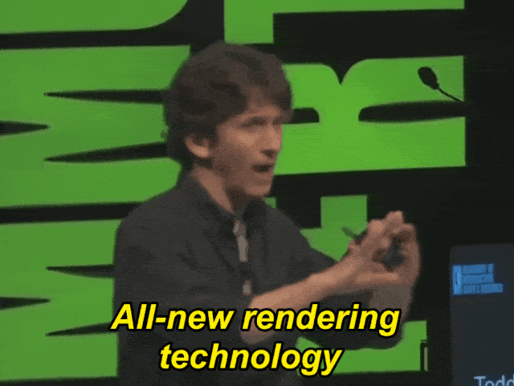
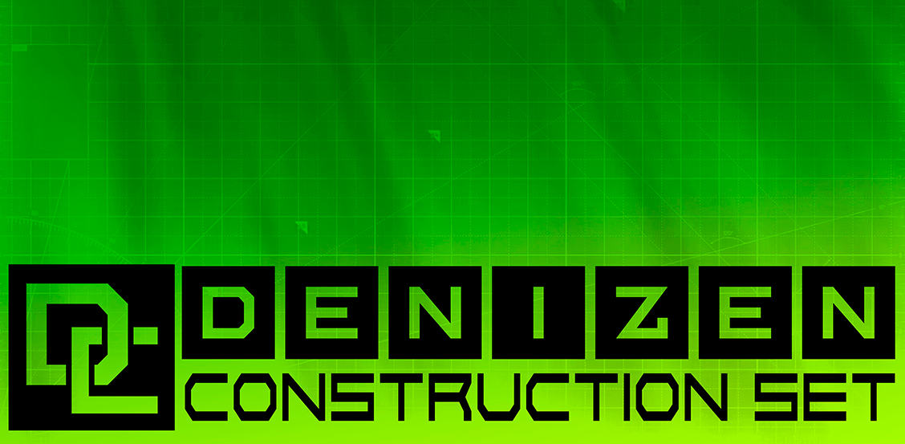
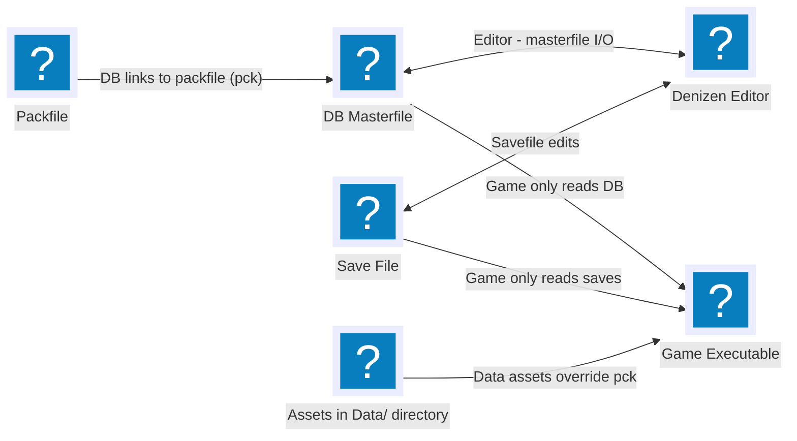

+++
title = "New Projects: Denizen and c0dex"
date = "2026-02-02"
+++
Looking to the future.<!--more-->
***
Before getting into the heavy stuff, I'd like to say that I'm using this post to announce two projects, Denizen, and c0dex! Denizen is a technical project where I'm developing a framework on top of Godot for the kinds of games I want to make, and c0dex is an open, creative project for worldbuilding through writing folklore as opposed to authoritative definitions of 'canon.' More on that later.

 # The End of DDGame
With a heavy heart, I've decided to cancel DDGame. No, I am not shelving it to return to it at a later date, I'm de-facto killing the project. It's been in a tough spot on all fronts, and it simply isn't the game i've got in my head. Some of its foundations were from the ideas a younger me had, and it feels like I've sunken too many hours into this project. I have, undoubtedly, learnt a lot in the process. That said, I really enjoyed working on Skitter, and I am ready to develop smaller games alongside Denizen, since I'd like to do more of that while working towards \<insert next major game project here\>.    

In addition to practical reasons, there are political and mental-health related reasons for my decision, too. Developing it has been pretty exhausting, both physically because it got too big in scope, and mentally because of The Current State of The World™. The world of DDGame was a speculative dystopia when it started out, but what do you even do when reality is worse than the fiction you come up with? What do you even *say* when there are worse things that are going on in the world, which don't need *saying* as much as they need *listening* about?

# Enter: Fantasy
The above reasons have compelled me to try something different, and do something related to where my _love_ for games stems from. If you've talked to me for a while, it's no surprise that The Elder Scrolls is my favourite series. While my interest in game development itself began with a [How It's Made segment on Ubisoft Montreal's Prince of Persia: The Sands of Time,](https://youtu.be/Y7RE8Spsa5s) I believe it was the 3D Elder Scrolls trilogy of Morrowind, Oblivion and Skyrim that has shaped my game design philosophies the most-- specifically, the culture, the development processes and core ideology between those years. As a teenager with a massively underpowered Intel Atom processor, no dedicated graphics and 1 GB of RAM in the early 2010s, the best I could do about these games (save for Morrowind) was dream about the vast world out there that was crafted for them. I would listen to the audio from the behind the scenes documentaries for [Oblivion](https://www.youtube.com/watch?v=6omNdYCooac) and [Skyrim](https://www.youtube.com/watch?v=Nf55GOfp984), and Todd Howard's [DICE 2012 Keynote](https://www.youtube.com/watch?v=7awkYKbKHik) as I rode home from school on my bicycle. I've spent countless hours on the [Unofficial Elder Scrolls Pages](https://en.uesp.net/wiki/Main_Page), and I'll gladly talk your ear off about this if given the chance.

I believe that the unique charm of The Elder Scrolls as a series and its longevity comes from two things. First, is its sense of ludic harmony, afforded by how the Creation Engine operates. I have elaborated this in the [other post going live today](/posts/skyrim/), my essay from my application to the Centre for Digital Media. The second is its approach to worldbuilding and lore, as developed primarily by former Bethesda writers and designers, Michael Kirkbride and Kurt Kuhlmann. Both of these serve as inspiration for Denizen and c0dex respectively. 

# Denizen
Before getting into the nitty-gritties about architecture, I'm super happy with the graphical capabilities of Godot, which I intend to use as a base. I've had a really good time working with it and pushing the engine to its limit, and it only keeps getting better over time!
  
I used a combination of Godot's built-in VoxelGI, baked lightmaps (I will make a post about this process at a later date) and some elbow grease, I've been able to get pretty neat results with this engine. The recent 4.6 update has been instrumental in covering the gaps that previously existed because of a bad screen-space reflection implementation, and I'm especially happy with the sky shader, though things keep getting better with iteration. This is what my test scene looks like:
  
So without further ado, let's talk about Denizen. Part of it is custom tooling for better iteration, but the core idea is to "get to the fun part faster." This would allow me to experiment with gameplay without having to reinvent the wheel everytime, or having to rely a lot on third-party assets while 'sketching out' gameplay. 
  

At a very high level, this is pretty much what the whole Denizen architecture looks like. What I came to figure out is that ideally, the Construction Set and the actual game executable shipped to the players must have two different codebases (with some overlapping modules). The game should not care about where its data comes from, so the game's runtime itself only contains game logic that is stored in resource files. Meanwhile, the resource files are split into 2 types, the masterfile and the packfile. The packfile only stores content like models, textures, audio files, etc.

The Masterfile (as in _the original of a document or of a recording_) is a SQLite database containing massive tables that contain the actual "logic" sotospeak. So for example if you have, say, a trap, it is going to be in the "interactable props" table which could have columns like name, base model, activated model, particle effect, sound, etc. and each row contains only the addresses to those things which are in the packfile. Using this simple base, you can have progressively more complicated logic, because tables can refer to other tables in the Construction Set for authoring the masters, and in the game, which reads said masters.

For a more complex example, if you want to do, say, a new NPC, you can build its dialogue tree using the dialogue table, which references things in the voicelines table for instance, which itself references the lipsync table, which contains a reference to the packfile and text specific to the language being used, accounting for localisation.

Further scripting can be done through [MiniScript](https://miniscript.org), a simple, miniature scripting language:
  
These miniscript scripts can be stored as strings within the masterfiles. For simplicity, I'm going to enforce a soft guideline to not use any of its object-oriented methods and instead, all the console commands in the game are available to it as intrinsics/events. And that's the Denizen stack in a nutshell!

# c0dex
You must've noticed the 0 instead of an o in codex. This is because it pays homage to [Michael Kirkbride's project, C0DA.](https://c0da.es/readc0da/)

As I've mentioned earlier in this post, there's no authoritative lore of TES but rather the lore is drawn from conflicting writings and accounts and actual gameplay. This is because most of the lore work began with these books as opposed to building a canon as is typical in fantasy worldbuilding. C0DA takes this a step further. It's got its own story that's weird and convoluted, but there's a metatextual thing going on about how _canon isn't real, actually._

Because of how open ended and non-authoritative the elder scrolls world is by design, folklore is lore, folklore going beyond just the inhabitants of the world but the players and fan-creators and modders themselves. It's fanon that the player character of morrowind is an argonian in a funny twist of dramatic irony. Modders expand on the lore through their questmods and even something as inconsequential as a coin overhaul. Because of the possibility space there, who knows, maybe the prophecised champion of azura really was an argonian. Some stories have septims as a unified currency across time; some stories split them into alessia, kagrenacs and septims. Each story of each player is just as valid because of Dragon Breaks, where time itself *breaks* and everything, and nothing happens at the same time. In a manner of speaking, that's how folklore has always worked before the corporate definitions of "canon" became mainstream. 

I'll put forth what Kirkbride had to say about this:  

`"As for canon, it's really all interactive fiction, and that should mean something to everyone. That said, I appreciate and understand the stamp of "official", but I think it will hurt more that it will help in the long run. TES should be Open Source. It is for me."`

Drawing inspiration from this, I intend to start the c0dex project, where I will be writing short stories and lorebooks as I build the fantasy world of Yesset, for whenever I eventually get around to building that game. c0dex is also open-source, and folks will be free to contribute to the project however they like, on the principle of "Yes, and..."

The sites for both of these projects will be going up at a later date, as my schedule clears up a bit. Until then, my creative pot is full and bubbling, and I can't wait to work on these two.