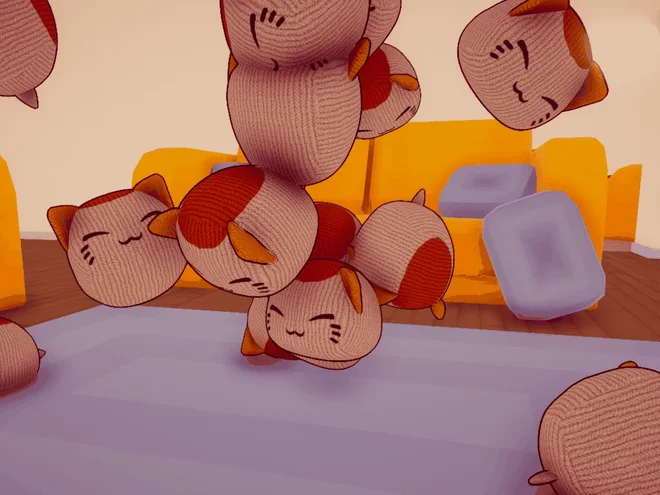
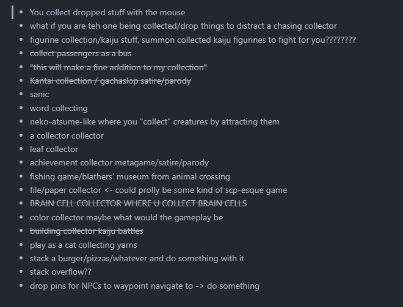
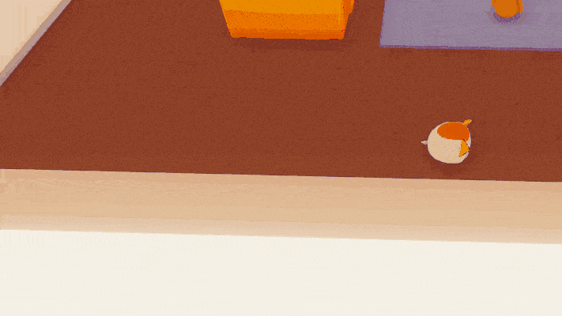

+++
date = "2025-10-07"
title = "LD58: The Skitter Kit"
+++

A post-jam reflection of my Ludum Dare 58 entry.<!--more-->
***
*This is the project's post-jam reflection. A technical overview of The Skitter Kit is available in the projects section.*

[**The Skitter Kit** was my return to game jams]((https://ldjam.com/events/ludum-dare/58/ld58-2)) after almost 7 years. I've had a few side projects, on-and-off, but nothing particularly _complete_ per se, and this was my attempt to fix just that. Ludum Dare was [my first jam](https://ldjam.com/events/ludum-dare/41/spatialsurf) from when I first got into gamedev seriously, so it felt apt to come back to it after all this time. 

The wildest thing about this jam was that I had about 30 or so ideas, but turning them into something that’s possibly fun, unique and with good push/pull and risk/reward was a bit more complicated than I’d thought.

Ultimately, I decided on mixing two ideas from the list:  
**-** What if you are the one being collected/drop things to distract a chasing collector  
**-** Play as a cat collecting yarns    

Mixing these two ideas together resulted in a game where you play as a cat collecting balls of yarn spread throughout the game's world, which is limited to a house with the typical 4-square layout which is quite commonly seen in many game maps. While you're collecting these balls of yarn, a particularly enthusiastic dog with a fascination for cats hunts you down if it sees you. Collecting three balls of yarn allows you to spawn a decoy to distract the dog, for it supposedly cannot tell the difference between a real cat and a decoy. This concept seemed to provide decent push and pull, which a lot of players have found engaging. 

While I wanted to have randomized spawns for the yarns, the time limit meant I could not add that feature in a way that would do the game justice. Instead, the game features 25 fixed positions for the yarn balls, some of which require challenging maneuvers, platforming and some creativity from the player in moving physics objects to build a makeshift staircase to reach some of them. Interestingly, one player found out that you can stack the decoys to gain altitude, which also revealed a soft-lock situation in the game. Interesting! 

Sticking with fixed spawns resulted in there being no goal at the end. When you collect 25 yarns, nothing happens. To remedy this, I added an endless "challenge" mode where the dog always chases you. Of course, there are ways to toy with the navmesh such that the dog can never reach you, but for the purposes of a 72 hour game jam, it had to do.

Graphically, since this game needed to run on as many devices as possible, I had a tight performance budget. I wanted to have the house feel warm and approachable, but also wanted some decent depth to it. I ended up using many of the tricks I experimented with earlier this year, which I go over in [this blog post.](/posts/indirect-depth/) Likewise, I also wrote a script to fade out objects that obscured the cat for visibility.

New this time was me writing my own custom shader for the cat! Primarily, the shader gives the cat a cartoony outline, but in the original concept for the game, the player could collect multiple different colours of yarn balls. The colour of these collected yarns was supposed to be taken into account when spawning decoys, such that no two spawned decoys would be identical. While this could not be achieved within the time limit, the shader does still have the functionality to do so.

  

Under the hood, it uses a channel-packed image texture to mask out certain parts of the model. This allows us to change the colour of the model's various parts as needed. The shader also has an additional detail texture set to make the decoys appear crocheted.

While this was a good effort, there were a few glaring issues which I could not address in time; for instance the controls and overall responsiveness could be done in a significantly better fashion. 

As for audio, [Izzyience,](https://izzyience.bandcamp.com/music) a very talented and skilled musician composed the music for this game, while I implemented it in-game using the FMOD middleware. You can listen to it here:  [   Izzyience - The Skitter Kit OST [Full Soundtrack]](https://youtu.be/HYi7j0o-W3M)

Lastly, the game's source code as well as the entire Unity project is available under the GNU General Public License 3.0:  
[ surfacedfox/LD58](https://github.com/surfacedfox/LD58)