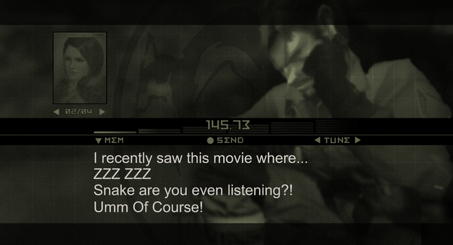
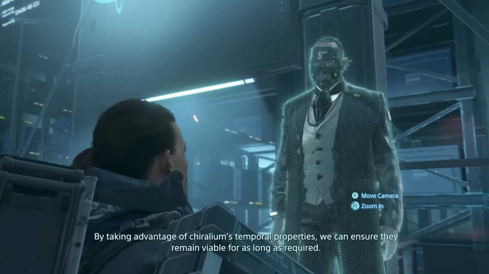

+++
title = "Characters speaking *at* the player"
date = "2025-08-28"
+++
Something I noticed in Metal Gear Solid V and Death Stranding.<!--more--> 
***
So I have been playing Metal Gear Solid: Delta lately, and the codec calls in the game reminded me of just how... quiet Venom Snake and Sam Porter-Bridges are in MGSV and Death Stranding. Snake's chattiness in MGS3/Delta really stood out to me in comparison to V, and it really checks out-- he's a lot more verbally involved in the first several games. 

Both of these games feel like a bunch of characters talking at Venom Snake/Norman Reedus and I wonder if that shift is because of how expensive it is to hire screen actors as opposed to voice actors. Both games have a radio system, but they feel so dead and preachy compared to David Hayter's codec calls.

Notably, in Metal Gear Solid V, Venom Snake was played by Kiefer Sutherland as opposed to David Hayter. Likewise, while Guillermo Del Toro provides his likeness to Deadman in Death Stranding, he's voiced by , a professional VA. Tommy Earl Jenkins also has extensive VA experience, as opposed to any of the other screen actors, so maybe he has different contract terms for his screen/mocap performance and voice.