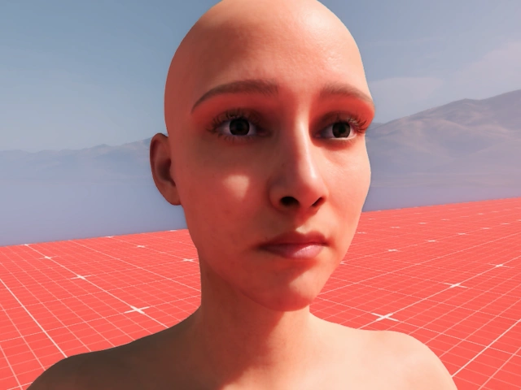
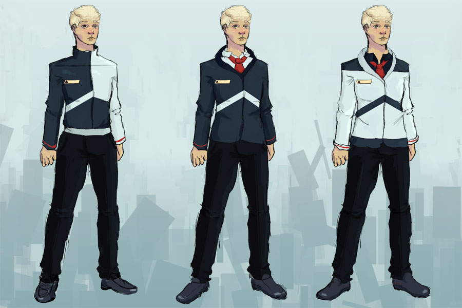
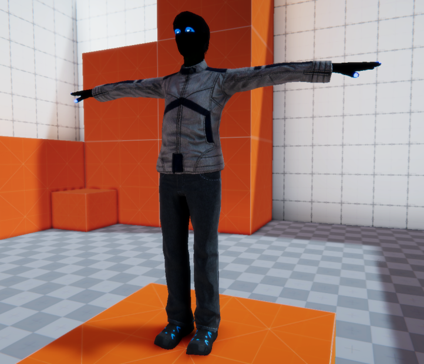
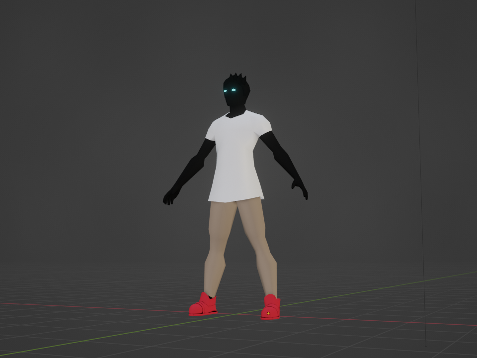
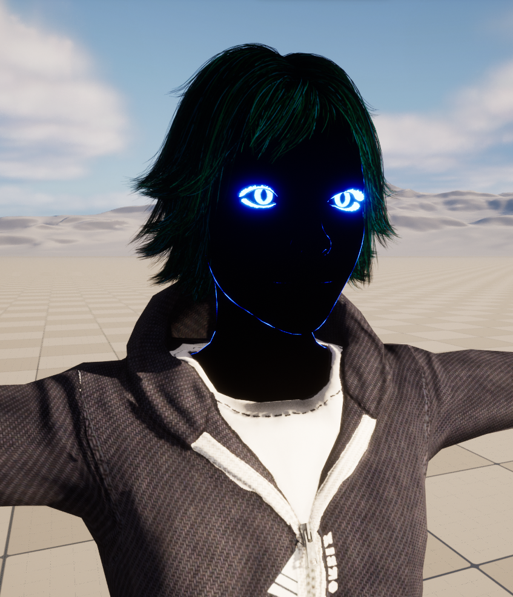
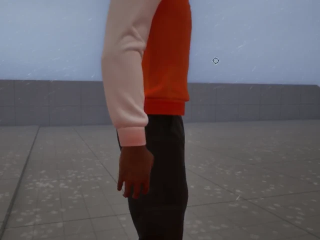

+++
image = "ddgame-techart-thumb.jpg"
date = "2025-09-30"
title = "'DDGame' - Showcase"
type = "gallery"
+++
'DDGame' is a long term, high production value game project that I've been working on for a good bit. Using the powerful Unreal Engine has allowed us to aim high as a small team. This is my own, original concept, and I wear a lot of hats along with my team. My responsibilites include but are not limited to gameplay and systems programming, art direction, and shader development. These are some highlights of  the project.

# Project Stack
**- Engine:**   
**- Languages:**      
**- Shaders and Visual:**    
**- Pipeline:**   
**- DCC:** 
  
**- Middleware:** n/a    
**- Skills Utilized:** Animation blueprints, project management, art pipeline design, texturing, modelling.  

# The 3 C's
Character, Camera and Controls are the three fundamental C's of a game. Using animations from Epic's Game Animation Sample Project, I developed a custom set of movements for our unnamed protagonist, who we internally call 'Pup'. The following video covers the special features of this setup.



# Possession
In DDGame, the core gameplay revolves around the ability to assume control of NPCs, presenting an interesting push/pull dynamic.
 

# 'Spectre' Transformation
The player assumes the role of a 'spectre' and can transform from a typical humanoid to this special form. This is a multi-phase shader for the transformation, and blends between a complex, realistic human skin shader and a stylized 'spectral' shader.

# Spectre Model Process
...Of course, the actual model for the player also went through a lot of iterations. The earliest blockout was designed using Fuse, a human blockout abandonware by Mixamo, which was acquired by Adobe in 2019. As a part of the acquisition, they had made the legacy version of Fuse free for users. 

This initial concept was later re-iterated on by [Andrew Walker](https://www.artstation.com/andrew-double-u/profile), and became the foundation for the Spectre model we eventually ended up using:

Instead of using Fuse, this one had a low-poly initial blockout and was further refined to the final version in use:

I did extensive texture work using the layered material I later used in [The Skitter Kit](/projects/ddgame-techart). The final model with baked textures can be viewed in the embed below:

Hovering on the embed and selecting the Model Inspector icon () will allow you to observe the texture spread, topology and a few other options.

# Wind Effects
Weather effects ground the player and other objects in the game world. We use a simple vertex displacement shader paired with perlin noise to make clothing flap convincingly in strong winds.

# Triplanar Shader
To assist the creation of natural objects like rocks and cliffs, the game uses triplanar projection, allowing us to use a variety of rock assets without having to worry about repetition. Triplanar projection also naturally adds moss to upward-facing surfaces.
