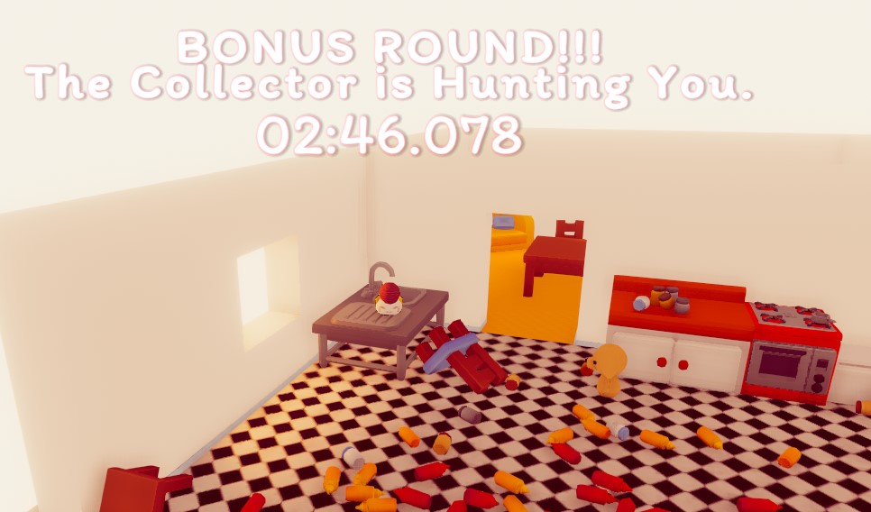
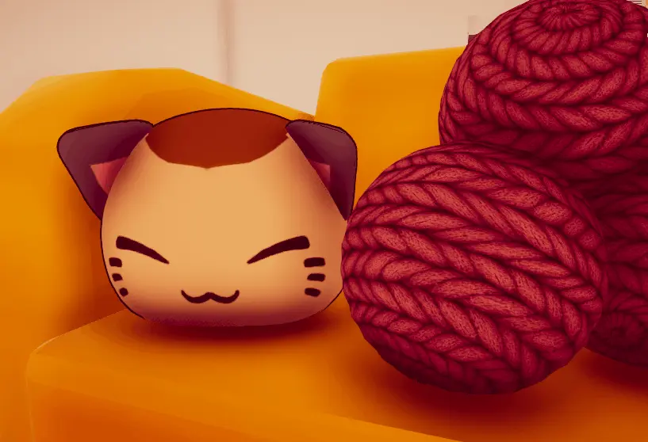

+++
image = "skitter-thumb.webp"
date = "2025-10-07"
title = "The Skitter Kit"
type = "gallery"
+++
**The Skitter Kit** is a 3D stealth-collection game where you play as a cat avoiding an over-enthusiastic dog while collecting yarn balls scattered throughout a house. Created in 72 hours for [Ludum Dare 58](https://ldjam.com/events/ludum-dare/58/ld58-2), this project marked my return to game jams after a [7-year hiatus](https://ldjam.com/events/ludum-dare/41/spatialsurf), and secured the 104th rank overall, and 49th rank in graphics out of ~1000 participants.

# Links
**- Play it on itch.io:** [ The Skitter Kit](https://surfacedfox.itch.io/ld58)  
**- Source Code:** [ surfacedfox/LD58](https://github.com/surfacedfox/LD58/)  
**- Ludum Dare Page:** [󰊗 The Skitter Kit](https://ldjam.com/events/ludum-dare/58/ld58-2)  

# Project Stack
**- Engine:**   
**- Language:**   
**- Shaders and Visual:**   
**- Pipeline:** n/a  
**- DCC:** 
  
**- Middleware:**   
**- Skills Utilized:** Game design, systems development, game feel, shader development, texturing.

I had been working on two large projects for the past several years; Primarily XScape, which is an industry-facing application, and the other being my own game project, 'DDGame'. None of these are notably public-facing, and this is what prompted me to give Ludum Dare a shot again after all this time.

The jam's theme this time was 'Collector'. This meant that while the theme provided a pretty large possibility space, it would come down to the specifics of how unique a concept feels and its actual execution more than prior themes. I had about 30 or so ideas, but turning them into something that’s possibly fun, unique and with good push/pull and risk/reward was a bit more complicated than I’d originally anticipated.

Ultimately, I decided on mixing two ideas from the list:  
**-** What if you are the one being collected/drop things to distract a chasing collector  
**-** Play as a cat collecting yarns    

Mixing these two ideas together resulted in a game where you play as a cat collecting balls of yarn spread throughout the game's world, which is limited to a house with the typical 4-square layout which is quite commonly seen in many game maps. While you're collecting these balls of yarn, a particularly enthusiastic dog with a fascination for cats hunts you down if it sees you. Collecting three balls of yarn allows you to spawn a decoy to distract the dog, for it supposedly cannot tell the difference between a real cat and a decoy. This concept seemed to provide decent push and pull, which a lot of players have found engaging. 

While I wanted to have randomized spawns for the yarns, the time limit meant I could not add that feature in a way that would do the game justice. Instead, the game features 25 fixed positions for the yarn balls, some of which require challenging maneuvers, platforming and some creativity from the player in moving physics objects to build a makeshift staircase to reach some of them. Interestingly, one player found out that you can stack the decoys to gain altitude, which also revealed a soft-lock situation in the game. Interesting! 

Sticking with fixed spawns resulted in there being no goal at the end. When you collect 25 yarns, nothing happens. To remedy this, I added an endless "challenge" mode where the dog always chases you. Of course, there are ways to toy with the navmesh such that the dog can never reach you, but for the purposes of a 72 hour game jam, it had to do.

Graphically, since this game needed to run on as many devices as possible, I had a tight performance budget. I wanted to have the house feel warm and approachable, but also wanted some decent depth to it. I ended up using many of the tricks I experimented with earlier this year, which I go over in [this blog post.](/posts/indirect-depth/) Likewise, I also wrote a script to fade out objects that obscured the cat for visibility.

New this time was me writing my own custom shader for the cat! Primarily, the shader gives the cat a cartoony outline, but in the original concept for the game, the player could collect multiple different colours of yarn balls. The colour of these collected yarns was supposed to be taken into account when spawning decoys, such that no two spawned decoys would be identical. While this could not be achieved within the time limit, the shader does still have the functionality to do so. Drawing inspiration from how we handle clothing in my other project, ['DDGame'](/projects/ddgame), it uses a channel-packed image texture to mask out certain parts of the model. This allows us to change the colour of the model's various parts as needed. The shader also has an additional detail texture set to make the decoys appear crocheted.

  

Audio is always an important part of any interactive experience. I came up with a quick list of audio assets I needed, scoped appropriately, and my friend [Izzyience,](https://izzyience.bandcamp.com/music) a very talented and skilled musician composed the music for this game. I implemented the audio assets and music in-game using the FMOD middleware, setting up a good amount of randomisation to ensure the sounds don't feel repetitive, while also setting up fades between the primary music track to reflect the dog's alertness level. We later released the soundtrack separately, which you can listen to here:
  

More than just being a jam project, The Skitter Kit really validated my ability to scope, execute, and deliver under tight constraints. This was a refreshing change of pace, and a much-needed one at that, to work on something more upbeat, fun and whimsical instead of the more tonally serious projects I've been involved in. 