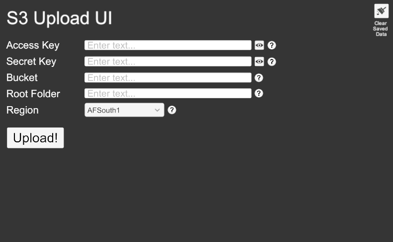
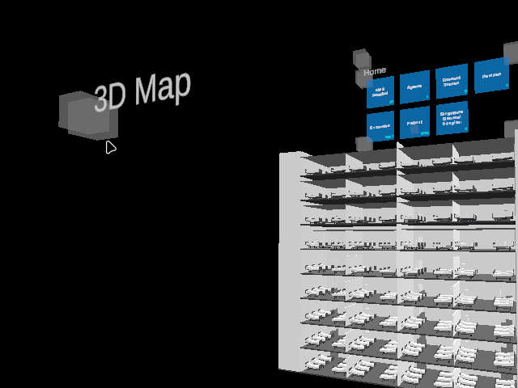

+++
image = "xscape-thumb.webp"
date = "2025-10-31"
title = "My contributions to XScape, a Digital Twin Client"
type = "gallery"
+++

XScape is the front-end client for 4D-DOSS (4-Dimensional Disease Outbreak Surveillance System), a healthcare platform recognized with Singapore's 2023 National Healthcare Innovation and Productivity Medal. 

**_Source code is available only on request, confidentially, and with approval from AxoMem Pte. Ltd._**
  
# Project Stack
**- Engine:**   
**- Languages:** 


   
**- Shaders and Visual:** n/a  
**- Pipeline:** 


    
**- DCC:** 
  
**- Middleware:**   
**- Skills Utilized:** Systems development, software engineering and architecture, interop, tooling, UI design.   


  
#  
As the sole front-end engineer on a 4-person core team at AxoMem, I have been involved with features and enhancements pertaining to XScape's architecture, features supporting real-time disease surveillance and contact tracing operations, and quality-of-life enhancements. 

# S3 upload tool
I've built several utilities, modules and features in the past three years, but one of the earliest ones I can recall is when I built a utility to upload content to an AWS S3 bucket from the project's editor tool as an optional supported host for the digital content used in XScape. Incidentally, it is the least integrated part of the project, and is practically a standalone module. Over time, my work would get deeper, and more integrated, while still remaining modular enough to isolate during maintenance.
 
# Tag Manager
The Tag Manager was one of the most complex systems I've had the pleasure of both, developing and designing. For contact tracing, one of the key features of 4D-DOSS, there needed to be a utility to tag patients matching certain criteria, like patients tested positive for a given disease. This system finds patients that relate to that criteria, and tags and enumerates them. This list can be used to locate patients, and also serves as a staging ground to run contact traces and other analyses. Rather than manual selection taking several hours, this feature reduces it down to a single click for selection, and a quick filtering step before running an analysis.
In my efforts to improve accessibility across the board, I also implemented a feature to darken every alternate list entry to improve visibility.
 
# Search and Pagination
I'd be remiss if I didn't mention some of the other quality-of-life improvements I've made to XScape over the years. XScape can load multiple kinds of datasets from its backend, and over time, we would get menus with over 30 items within the flyout. This was unwieldly, and the users dubbed it the "long long list". The QoL feature which I'm particularly proud of is to paginate these long lists of menu content, and to make them searchable, as well as retain their pagination when searching. 
 
# "Axelle," a chat bot and text-based control interface
Axelle is the internal name for our chat bot and text control interface, which was a feature I developed from start to end. This interface is both, a way to control *most* XScape functions through text prompts, and the groundwork for future agentic development. Presently, Axelle uses an AI Markup Language backend, but leaves the door open for large language models.
 

Over three years with XScape, my role has evolved from building isolated utilities to owning core architectural decisions. XScape represents my most sustained work in a single codebase, and taught me how to balance long-term architectural thinking with immediate feature delivery. In addition to the above, I'm presently working on extending the  interoperability layer I've built between Unity and Godot to handle user generated content, and there's more to come, still!