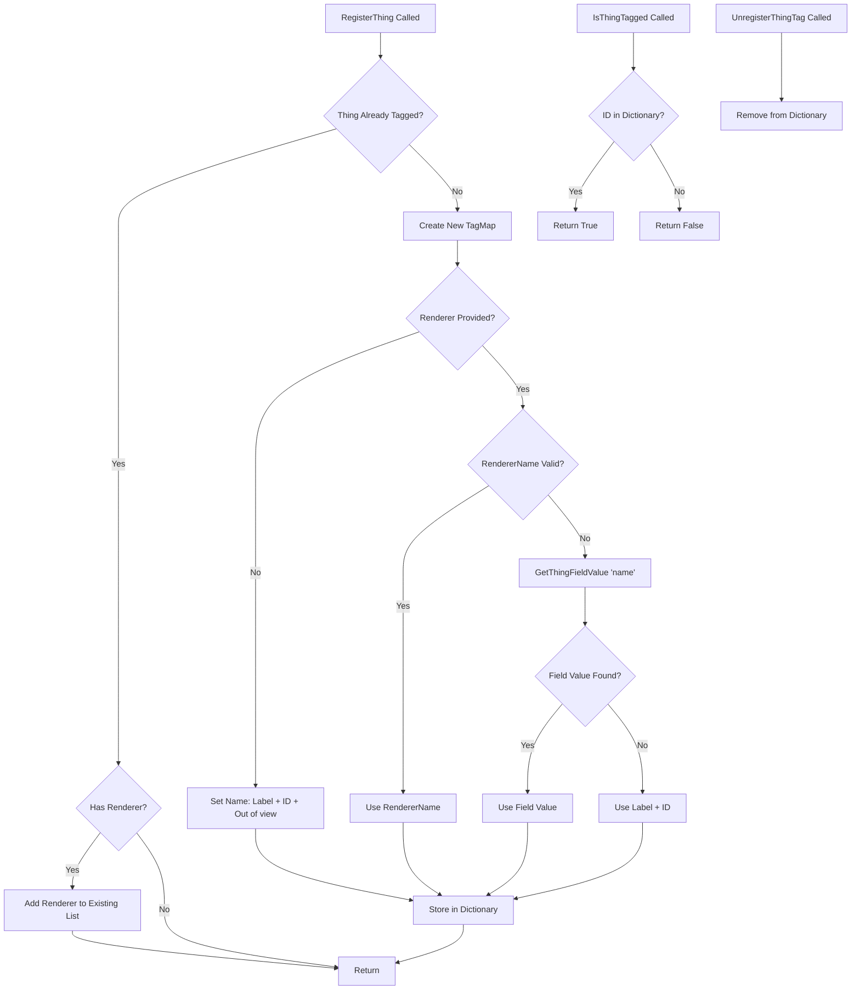
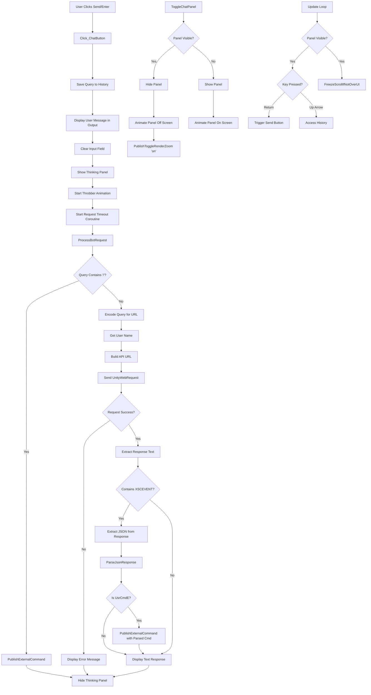
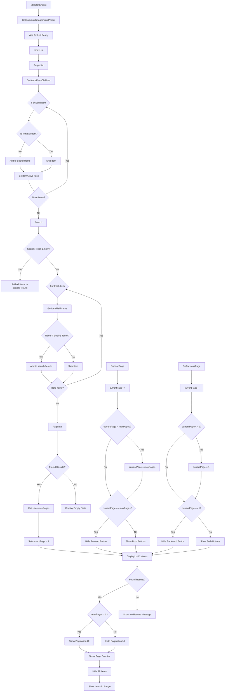
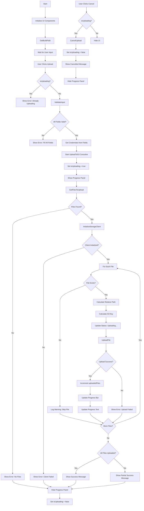

# Isolated Components

This directory contains isolated, genericized versions of components from the XScape project. These components have been extracted and modified to remove dependencies on the larger codebase, according to proprietary guidelines.

## Components
### 1. TagManager
**File:** `TagManager.cs`
A component that manages tagging of items in a UI system. It maintains a dictionary of tagged items and their associated renderers.  
**Key Features:**
- Register/unregister tagged items
- Track multiple renderers per tagged item
- Query if items are tagged
- Editor-friendly debugging support

**Flow Diagram:**

### 2. AxelleBot
**File:** `AxelleBot.cs`  
A chatbot interface component that communicates with a backend API and provides a user-friendly chat interface.  
**Key Features:**
- Chat interface with input/output fields
- Web request handling for bot queries
- Command processing and event publishing
- Query history management
- Panel animation and UI controls

**Flow Diagram:**

### 3. Pagination
**File:** `Pagination.cs`  
A pagination component for managing large lists of UI items, extracted from the PanelUtils component.

**Key Features:**
- Paginate large lists of items
- Search functionality
- Page navigation (forward/backward)
- Configurable items per page
- World space canvas support

**Flow Diagram:**

### 4. S3UploadUI
**File:** `S3UploadUI.cs`
A UI component for uploading files to AWS S3  
**Key Features:**
- Input fields for cloud storage credentials
- File upload progress tracking
- Batch file upload support
- Error handling and status reporting
- Configurable build path

**Flow Diagram:**

## Proprietary Dependencies
- XBase.ThingPtr
- XScape.ThingRenderer
- Axomem.XScape.Core.Events.EventHub

## External Dependencies
- DOTween
- Newtonsoft.Json
- AWS SDK

## Notes
All proprietary and external dependencies have been replaced with generic function placeholders. Event system calls have been abstracted to generic functions. 
These components demonstrate:
- UI system architecture
- Event-driven programming patterns
- Async/await and coroutine patterns
- Generic programming and abstraction
- Cloud storage integration patterns
- Pagination and search algorithms

